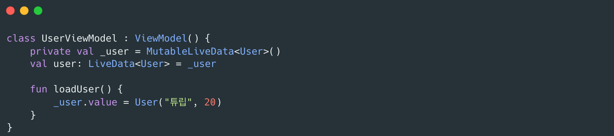
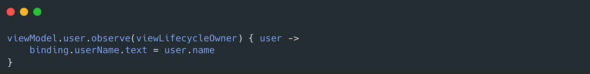
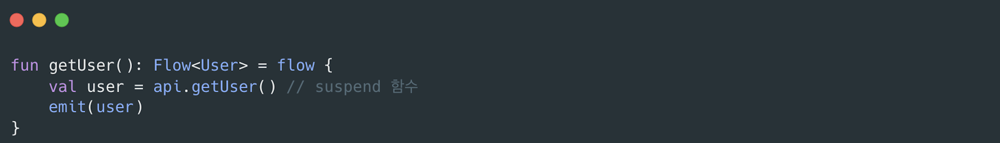
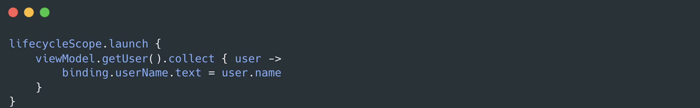
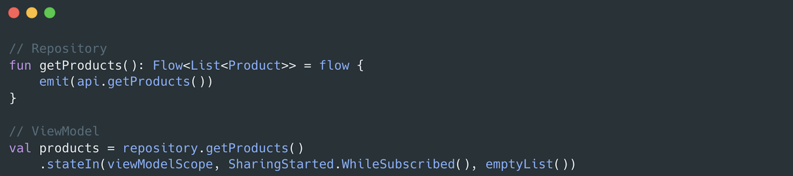
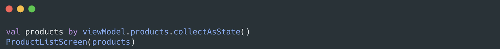
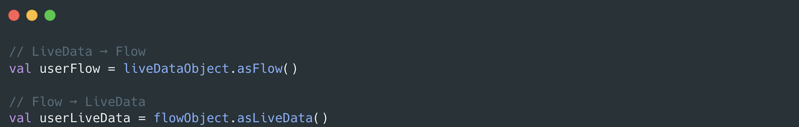

# 안드로이드에서의 UI 동기화 : LiveData와 Flow

## 1. 서론

안드로이드 개발을 하다 보면 `LiveData`와 `Flow`는 모두 “데이터를 관찰(Observe)”하는 역할로 자주 언급됩니다.  
특히 코루틴 기반의 `Flow`가 등장하면서 "현업에서는 LiveData를 잘 안쓰는 거 같아.”라는 이야기가 들리기도 합니다.

하지만 실제로는 두 기술 모두 장단점이 분명합니다.  
이 글에서는 **LiveData와 Flow의 구조적 차이**, **사용 방법**, 그리고 **선택 시 고려할 점**을 살펴보며,  
“무엇이 더 좋은가?”가 아니라 “언제 어떤 것을 사용하는 것이 적절한가?”를 정리해봅니다.

## 2. LiveData: 안드로이드 생명주기에 특화된 옵저버

`LiveData`는 Android Jetpack의 구성요소 중 하나로, **UI 생명주기(Lifecycle)에 안전하게 데이터를 관찰할 수 있는 클래스**입니다.

### 사용 예시

ViewModel

UI

### LiveData의 장점
- Activity, Fragment 생명주기를 인식하고 있어 구독 등록, 해제를 신경쓰지 않아도 됩니다.
- 사용법이 단순해서 쉽게 적용해볼 수 있습니다.
### LiveData의 한계
- 안드로이드 플랫폼에 종속적입니다.
- map, filter 등 변환 연산자를 제공하지 않아 유연성 측면에서의 아쉬움이 있습니다.

## 3. Flow: Kotlin 표준 비동기 스트림
Flow는 Kotlin Coroutines에서 제공하는 비동기 데이터 스트림입니다.

시간에 따라 변하는 데이터를 emit → collect 구조로 처리합니다.

### 사용 예시

ViewModel

UI

### Flow의 장점
- Kotlin 표준으로, 서버, KMP(Kotlin Multiplatform) 등에서도 사용할 수 있습니다.
- 내부에서 suspend 함수를 사용하고 있어 비동기 작업과 결합이 좋습니다.
- map, filter, combine 등 다양한 연산자를 제공합니다.
- 구독 시점에 데이터 생성이 시작되도록 해서 불필요한 연산을 방지할 수 있습니다.
### Flow의 한계
- 안드로이드 생명주기를 직접 관리해야 합니다.
- suspend 개념, 코루틴에 대한 이해도가 필요해서 LiveData에 비해 러닝커브가 있습니다.

## 4. LiveData와 Flow 비교 요약

| 구분           | LiveData                          | Flow                                                     |
|----------------|-----------------------------------|----------------------------------------------------------|
| 플랫폼 종속성  | Android 전용                      | Kotlin 표준                                              |
| 비동기 처리    | 별도 처리 필요                    | suspend 지원                                             |
| 생명주기 관리  | 자동                              | 수동 (launchWhenStarted 등)                              |
| 연산자         | 제한적                            | 다양 (map, filter, combine 등)                           |
| 콜드/핫        | 항상 Hot                          | Cold 기본, Hot도 가능 (StateFlow, SharedFlow)            |
| 테스트 용이성  | Android Test 필요                 | JVM 단위 테스트 가능                                     |
| UI 바인딩      | DataBinding, XML 친화적           | Compose 친화적 (collectAsState())                        |

## 5. Flow를 안드로이드에서 사용하는 이유

최근 안드로이드에서는 `Flow`가 점점 더 널리 사용되고 있습니다.

이는 “LiveData가 나쁘기 때문”이 아니라, 앱 구조의 복잡성 증가에 대응하기 위해서입니다.

### 주요 이유 

1. 네트워크를 통해 얻어오는 과정부터 화면에 보여지기 까지 일관된 비동기 처리가 가능합니다.
    -  Flow는 suspend와 함께 작동하므로, Repository → ViewModel → UI로 이어지는 데이터 흐름이 자연스럽습니다.
    

2. Jetpack Compose와의 높은 호환성을 보입니다.
    - 많은 안드로이드 앱이 Compose로 구현되고 있습니다.
    - Compose에서는 collectAsState()를 통해 Flow를 자연스럽게 관찰할 수 있습니다.
     
3. 코틀린 표준 라이브러리로 작동하므로, 안드로이드 의존성 없이 테스트 할 수 있습니다.

## 6. LiveData를 유지해야 하는 경우

Flow가 많은 기능을 제공한다고 해서 모든 곳에서 교체할 필요는 없습니다.

LiveData는 여전히 다음과 같은 상황에서 유효합니다.

1.	XML + DataBinding 중심의 프로젝트
    - @{viewModel.text} 와 같은 XML 바인딩은 LiveData에서만 작동합니다.

2.	UI 생명주기 제어가 복잡한 경우
	- LiveData는 자동으로 생명주기에 맞게 등록, 해제되므로 Fragment 전환이나 화면 회전 시 안정적입니다.

### 상황별 LiveData, Flow 선택 제안표

| 상황                           | 권장 사용                         |
|--------------------------------|-----------------------------------|
| Compose UI 사용                | Flow (StateFlow/SharedFlow)     |
| XML + DataBinding              | LiveData                        |
| Repository, UseCase 등 비동기 로직 | Flow                            |
| 기존 프로젝트 유지보수           | LiveData                        |
| 테스트 중심 구조                | Flow                            |
| 복잡한 UI 이벤트 처리           | Flow (SharedFlow)               |

 
LiveData, Flow 서로 변환하는 기능도 제공하기에 UI는 LiveData 기반으로 사용하고 Repository, ViewModel 내부는 Flow로 점차 마이그레이션을 진행할 수 있습니다.
    

## 7. 결론

LiveData와 Flow는 모두 “데이터 옵저빙”을 위한 훌륭한 도구입니다.

LiveData는 “UI 생명주기에 맞는 데이터 안전성”을 위해 만들어졌고, Flow는 “비동기 데이터 스트림의 일관성”을 위해 설계되었습니다.

결론적으로 UI 중심, 단순 옵저빙에는 LiveData를 비동기 중심, 일관된 데이터 파이프라인에는 Flow를 선택하는 것이 합리적일 것이라 생각합니다.

기존 LiveData에서 Flow로의 전환은 단순한 기술 교체가 아니라, 데이터 흐름을 더 명시적으로 설계하기 위한 하나의 방향성입니다. 하지만 언제나 중요한 것은 “기술이 아니라 맥락”입니다.

프로젝트가 필요한 수준의 안정성과 유연성을 고려해, LiveData와 Flow를 균형 있게 선택하세요.